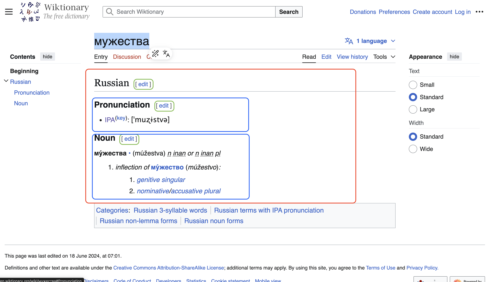

# DOM tree wrangler

Note: Some stuff that is very much in the air are mentionned in `Note: `

It is designed to be (eventually) used by [cognominal/spc-learn](https://github.com/cognominal/spc-learn) to process wiktionary pages. We use that as examples.

This is an informal presentation of 
* `idom`, a language to create html and 
* `sodom` to  process html.

Both use [jsdom ](https://github.com/jsdom/jsdom)

the eponymous exported functions are

```ts
    export function idom(s: string) : JSDOM { ... }
    export function sodom(processed: string, processor: string) : JSDOM { ... }
```

`idomStr` amd `sodomStr` are identical but return an html string insteead a value of type JSON.

The module name, `sodom`, is gruesome. That's the point. You will remember it.
It relies on jsdom which is a server-side module.
Probably, modulo some change of API, it could be used client side. TBD.


`idom` and `sodom` are a substitute for the mess of awful HTML syntax and DOM API.

# motivating example

Below is the screendump of the anglophone wiktionary page
for [мужества](https://en.wiktionary.org/wiki/%D0%BC%D1%83%D0%B6%D0%B5%D1%81%D1%82%D0%B2%D0%B0) annotated by color rectangles.
Russian ection is within red, subsections are within blue, edit button are with green.
See [wiktionary section](#wiktionary-section) for the html code of a subsection.




We want to: 
*  keep only the russian section. Code [here](#processing-the-russian-section)
* replace h3 subsections  by a [details](https://developer.mozilla.org/en-US/docs/Web/HTML/Reference/Elements/details)/summary structure. Code [here].(#processing-subsections) 
* remove the edit button. Code here.


## idom, sodom 

principles:
  * indentation instead of opening and closing tags
  * borrowing from css syntax
  * boworring from [raku](https://en.wikipedia.org/wiki/Raku_(programming_language)) [sigils](https://andrewshitov.com/2018/10/31/variables-in-perl-6-twigils/) and twigils.
  * probably js variable prefixed with a sigil will be interpolated in a sodom
    rule replacement
  * a sodom rule is like a regex subtitution but for a tree
  * also a sodom rule can be made modular like a raku rule

To avoid confusion, identation is done using tab. Other forms of space are
not allowed for indentation.

### idom

in idom, like in yaml, indentation is not a formating convention but is part of the syntax.

A element tag is representated by `<` and the tagname like :
  `<div`

Id and class attributes can be written the css way

non literal characters are character that have special meaning in `dom` or `idom`
like `#`, `*`, `(`, `)` and `<` must be escaped with a `\` 

<hr>

Element tag can be stacked:

`idom` code

```idom
<div <span
```
html equivalent 

```html
<div><span></span></div>
```

<hr>
Closing tag `>` is necessary to specify text (a TextNode)


So `idom` code with text

```idom
<div #someid .gap-2> some text with character escaping \<  and \*
```

 translates into the following `html`
   
```html
<div id="someid" class="gap-2">some text with &lt;
```

<hr>

The  `idom` code

```idom
<div #1 <div #2 # line ending starting by '# ' are comments which are ignored
<div #3
```

is equivalent to the following `html` 

```idom
<div #1 
	<div #2  
<div #3
``` 

that is to

```html
<div id="1">
	<div id="2">
<div id="3">  
```

<hr>

In the following, the idom version takes 3 lines but is more readable than the oneliner html or the indented multine `html`

```idom
<details
	<summary A summary
	Some explanation
```

```html
<details><summary>A summary</summary>Some explaination</details>
```


```html
<details>
	<summary>
		A summary
	</summary>
  	Some explaination
</details>
```

#### matching text

Note: probably will use  capture variable. Something like  `$\var=[ someregex ]`
`$\var` instead of raku `$<var>` because `<` and `>` are too much associated to tags.
Also the regex themselves could be raku like probably with a pragma `use rakurx`

### sodom builds on idom 

A `sodom` script contains rules and substitution.
The `dom` convention used to build a document are used to match
parts of a document in `sodom`.

A `rule` is a matcher while a `subst` is a matcher and a replacement.


A sodom rule is introduced by the keyword `rule`. It has a name.
Its body is a matcher and a replacement separated by `\n\n==>\n\n` in its own line.

#### Processing the russian section

* `*` is not greedy and matches siblings. Note: `.` would match one sibling.
* In the match section `$/russianWitk =` sets a capture variable which captures the submatch defined by the ruleexprs  until the next capture variable. In the replacement section, its value is used as replacement
* `<h2 | $ >` is a tentaive syntax that matches a `h2` element or the end of the JSDOM


Note: `(#id == "Russian")` is an expression. Expression are to be specified

```sodom
subst RussianSection
    *

$/russianWitk =
	<h2 (#id == "Russian")
	*

	<h2 | $

==>

$/russianWitk

```

#### Processing Edit

subst supressEditSection
	<span .mw-editsection

#### Processing subsections


```sodom
rule divh3 = 
  <div 
    <h3 
	*
  *
```

<hr>

```sodom

Note: section very incomplete

subst replace-h3-with-details
    $/ = 
        |divh3|


        > <divh3$
    
    ==>
    
    <details
      <summary
         $m-divh3
      Something small enough to escape casual notice.
    </details>
```


```html
<details>
  <summary>Details</summary>
  Something small enough to escape casual notice.
</details>
```

Note : I defined the rules/subst, not the way to use them.

## wiktionary subsection

A real wiktionary section handled in [processing subsections](#processing-subsections).
What follows the div element with class `mw-heading3` is specific to this subsection.

```html
<div class="mw-heading mw-heading3">
  <h3 id="Pronunciation">Pronunciation</h3>
  <span class="mw-editsection" data-nosnippet=""
    ><span class="mw-editsection-bracket">[</span
    ><a
      href="/w/index.php?title=%D0%BC%D1%83%D0%B6%D0%B5%D1%81%D1%82%D0%B2%D0%B0&amp;action=edit&amp;section=2"
      title="Edit section: Pronunciation"
      ><span>edit</span></a
    ><span class="mw-editsection-bracket">]</span></span
  >
</div>
<ul>
  <li>
    <a
      href="/wiki/Wiktionary:International_Phonetic_Alphabet"
      title="Wiktionary:International Phonetic Alphabet"
      >IPA</a
    ><sup
      >(<a
        href="/wiki/Appendix:Russian_pronunciation"
        title="Appendix:Russian pronunciation"
        >key</a
      >)</sup
    >: <span class="IPA">[ˈmuʐɨstvə]</span>
  </li>
</ul>  
```